# Lapres-Jarkom-Modul-3-IT25-2024

## Anggota

| Nama                                          | NRP          |
| ----------------------------------------------| ------------ |
| Mohammad Arkananta Radithya Taratugang        | `50272210xx` |
| Michael Wayne                                 | `5027221037` |

## Topologi

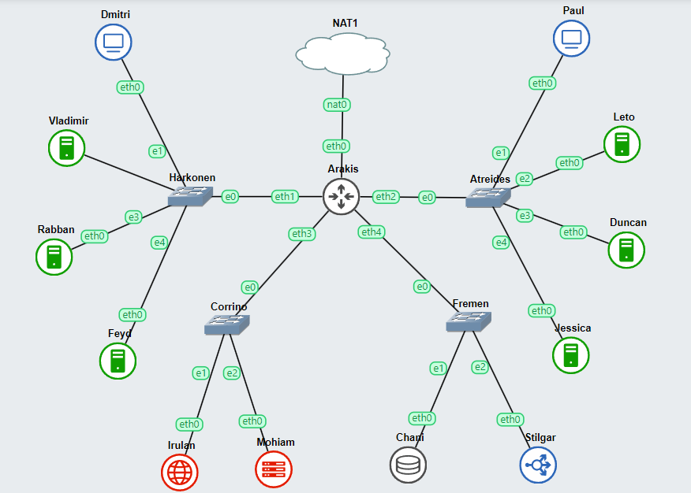

## Soal 1
Lakukan konfigurasi sesuai dengan peta yang sudah diberikan.

### Arakis (DHCP Relay)

```
auto eth0
iface eth0 inet dhcp
up iptables -t nat -A POSTROUTING -o eth0 -j MASQUERADE -s 10.76.0.0/16


auto eth1
iface eth1 inet static
	address 10.76.1.0
	netmask 255.255.255.0

auto eth2
iface eth2 inet static
	address 10.76.2.0
	netmask 255.255.255.0

auto eth3
iface eth3 inet static
	address 10.76.3.0
	netmask 255.255.255.0

auto eth4
iface eth4 inet static
	address 10.76.4.0
	netmask 255.255.255.0
```

### Harkonen (Switch 1)

**Vladimir (PHP Worker)**

```
auto eth0
iface eth0 inet static
	address 10.76.1.1
	netmask 255.255.255.0
	gateway 10.76.1.0
```

**Rabban (PHP Worker)**

```
auto eth0
iface eth0 inet static
	address 10.76.1.2
	netmask 255.255.255.0
	gateway 10.76.1.0
```


**Feyd (PHP Worker)**

```
auto eth0
iface eth0 inet static
	address 10.76.1.3
	netmask 255.255.255.0
	gateway 10.76.1.0
```

### Atreides (Switch 2)

**Leto (Laravel Worker)**

```
auto eth0
iface eth0 inet static
	address 10.76.2.1
	netmask 255.255.255.0
	gateway 10.76.2.0
```

**Duncan (Laravel Worker)**

```
auto eth0
iface eth0 inet static
	address 10.76.2.2
	netmask 255.255.255.0
	gateway 10.76.2.0
```

**Jessica (Laravel Worker)**

```
auto eth0
iface eth0 inet static
	address 10.76.2.3
	netmask 255.255.255.0
	gateway 10.76.2.0
```

### Corrino (Switch 3)

**Irulan (DNS Server)**

```
auto eth0
iface eth0 inet static
	address 10.76.3.1
	netmask 255.255.255.0
	gateway 10.76.3.0
```

**Mohiam (DHCP Server)**

```
auto eth0
iface eth0 inet static
	address 10.76.3.2
	netmask 255.255.255.0
	gateway 10.76.3.0
```

### Fremen (Switch 4)

**Chani (Database Server)**

```
auto eth0
iface eth0 inet static
	address 10.76.4.1
	netmask 255.255.255.0
	gateway 10.76.4.0
```

**Stilgar (Load Balancer)**

```
auto eth0
iface eth0 inet static
	address 10.76.4.2
	netmask 255.255.255.0
	gateway 10.76.4.0
```

### Dmitri dan Paul (Client)

```
auto eth0
iface eth0 inet dhcp
```

Planet Caladan sedang mengalami krisis karena kehabisan spice, klan atreides berencana untuk melakukan eksplorasi ke planet arakis dipimpin oleh duke leto mereka meregister domain name atreides.yyy.com untuk worker Laravel mengarah pada Leto Atreides . Namun ternyata tidak hanya klan atreides yang berusaha melakukan eksplorasi, Klan harkonen sudah mendaftarkan domain name harkonen.yyy.com untuk worker PHP (0) mengarah pada Vladimir Harkonen

### Irulan (DNS Server)

soal_1.sh
```
echo 'nameserver 192.168.122.1' > /etc/resolv.conf

apt-get update
apt-get install bind9 -y

echo '
zone "atreides.it25.com" {
        type master;
        file "/etc/bind/jarkom/atreides.it25.com";
};

zone "harkonen.it25.com" {
        type master;
        file "/etc/bind/jarkom/harkonen.it25.com";
};
' > /etc/bind/named.conf.local

mkdir /etc/bind/jarkom

touch /etc/bind/jarkom/atreides.it25.com
touch /etc/bind/jarkom/harkonen.it25.com

echo '
;
; BIND data file for local loopback interface
;
$TTL    604800
@       IN      SOA     atreides.it25.com. root.atreides.it25.com. (
                              2         ; Serial
                         604800         ; Refresh
                          86400         ; Retry
                        2419200         ; Expire
                         604800 )       ; Negative Cache TTL
;
@       IN      NS      atreides.it25.com.
@       IN      A       10.76.2.1
www     IN      CNAME   atreides.it25.com.
' > /etc/bind/jarkom/atreides.it25.com

echo '
;
; BIND data file for local loopback interface
;
$TTL    604800
@       IN      SOA     harkonen.it25.com. root.harkonen.it25.com. (
                              2         ; Serial
                         604800         ; Refresh
                          86400         ; Retry
                        2419200         ; Expire
                         604800 )       ; Negative Cache TTL
;
@       IN      NS      harkonen.it25.com.
@       IN      A       10.76.1.1
www     IN      CNAME   harkonen.it25.com.
' > /etc/bind/jarkom/harkonen.it25.com

echo '
options {
        directory "/var/cache/bind";

        // If there is a firewall between you and nameservers you want
        // to talk to, you may need to fix the firewall to allow multiple
        // ports to talk.  See http://www.kb.cert.org/vuls/id/800113

        // If your ISP provided one or more IP addresses for stable
        // nameservers, you probably want to use them as forwarders.
        // Uncomment the following block, and insert the addresses replacing
        // the all-0"s placeholder.

        forwarders {192.168.122.1;};

        //========================================================================
        // If BIND logs error messages about the root key being expired,
        // you will need to update your keys.  See https://www.isc.org/bind-keys
        //========================================================================
        //dnssec-validation auto;
        allow-query{any;};

        listen-on-v6 { any; };
};
' > /etc/bind/named.conf.options

service bind9 restart
```

### Arakis (DHCP Relay)

soal_1.sh
```
apt-get update
apt-get install isc-dhcp-relay -y

echo '# Defaults for isc-dhcp-relay initscript
SERVERS="10.76.3.2"
INTERFACES="eth1 eth2 eth3 eth4"
OPTIONS=""
' > /etc/default/isc-dhcp-relay

echo 'net.ipv4.ip_forward=1' > /etc/sysctl.conf

service isc-dhcp-relay restart
```

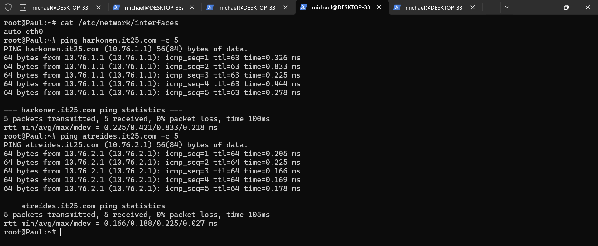
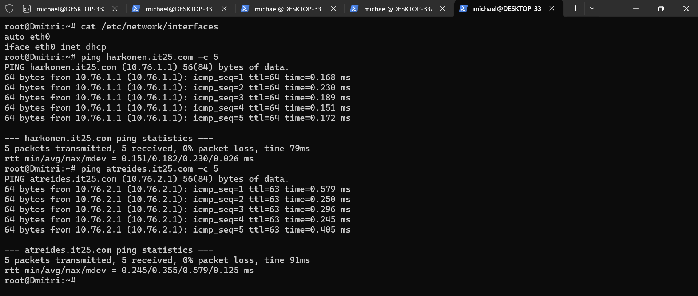

## Soal 2—5
Lakukan konfigurasi sesuai dengan peta yang sudah diberikan.Kemudian, karena masih banyak spice yang harus dikumpulkan, bantulah para aterides untuk bersaing dengan harkonen dengan kriteria berikut.:
1. Semua **CLIENT** harus menggunakan konfigurasi dari DHCP Server.
2. Client yang melalui House Harkonen mendapatkan range IP dari [prefix IP].1.14 - [prefix IP].1.28 dan [prefix IP].1.49 - [prefix IP].1.70 **(2)**
3. Client yang melalui House Atreides mendapatkan range IP dari [prefix IP].2.15 - [prefix IP].2.25 dan [prefix IP].2.200 - [prefix IP].4.210 **(3)**
4. Client mendapatkan DNS dari **Princess Irulan** dan dapat terhubung dengan internet melalui DNS tersebut **(4)**
5. Durasi DHCP server meminjamkan alamat IP kepada Client yang melalui House Harkonen selama 5 menit sedangkan pada client yang melalui House Atreides selama 20 menit. Dengan waktu maksimal dialokasikan untuk peminjaman alamat IP selama 87 menit **(5)**\
*house == switch

### Mohiam (DHCP Server)

soal_2_3_4_5.sh
```
echo 'nameserver 10.76.3.1' > /etc/resolv.conf

apt-get update
apt-get install isc-dhcp-server -y

echo '
INTERFACESv4="eth0"
INTERFACESv6=""
' > /etc/default/isc-dhcp-server

echo '
option domain-name "example.org";
option domain-name-servers ns1.example.org, ns2.example.org;

default-lease-time 600;
max-lease-time 7200;

ddns-update-style none;

subnet 10.76.3.0 netmask 255.255.255.0 {
}

subnet 10.76.4.0 netmask 255.255.255.0 {
}

subnet 10.76.1.0 netmask 255.255.255.0 {
    range 10.76.1.14 10.76.1.28;
    range 10.76.1.49 10.76.1.70;
    option routers 10.76.1.0;
    option broadcast-address 10.76.1.255;
    option domain-name-servers 10.76.3.1;
    default-lease-time 300;
    max-lease-time 5220;
}

subnet 10.76.2.0 netmask 255.255.255.0 {
    range 10.76.2.15 10.76.2.25;
    range 10.76.2.200 10.76.2.210;
    option routers 10.76.2.0;
    option broadcast-address 10.76.2.255;
    option domain-name-servers 10.76.3.1;
    default-lease-time 1200;
    max-lease-time 5220;
}
' > /etc/dhcp/dhcpd.conf

service isc-dhcp-server restart
```

### Dmitri dan Paul (Client)

all.sh
```
echo 'nameserver 10.76.3.2' > /etc/resolv.conf
```

Jalankan ```ip a```

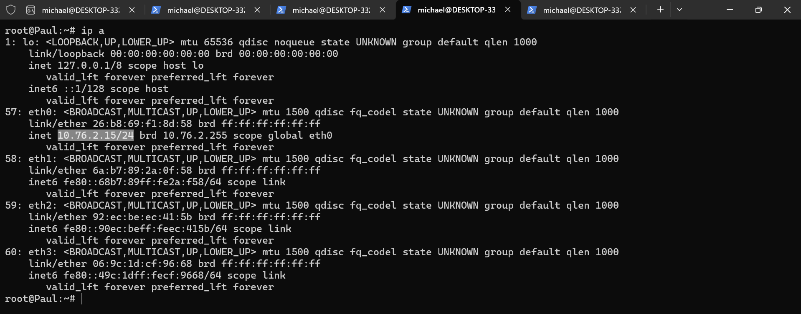
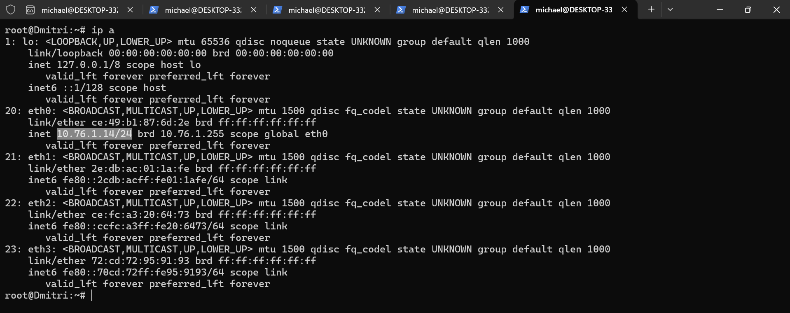

## Soal 6
Vladimir Harkonen memerintahkan setiap worker(harkonen) PHP, untuk melakukan konfigurasi virtual host untuk website berikut dengan menggunakan php 7.3.

#### Stilgar (Load Balancer)
```
apt-get update
apt-get install bind9 nginx -y

echo '
 upstream myweb  {
        server 10.76.1.1; #IP Vladimir
        server 10.76.1.2; #IP Rabban
        server 10.76.1.3; #IP Feyd
 }

 server {
        listen 80;
        server_name harkonen.it25.com;

        location / {
        proxy_pass http://myweb;
        }
 }' > /etc/nginx/sites-available/lb-jarkom

ln -s /etc/nginx/sites-available/lb-jarkom /etc/nginx/sites-enabled
rm -rf /etc/nginx/sites-enabled/default

service nginx restart
nginx -t
```

#### Worker Switch Harkonen
soal_6.sh
```
echo nameserver 10.76.3.1 > /etc/resolv.conf
apt-get update
apt-get install lynx -y
apt-get install wget -y
apt-get install unzip -y
apt-get install nginx -y
apt-get install php7.3 -y
apt-get install php7.3-fpm -y

mkdir -p /var/www/harkonen.it25.com

wget --no-check-certificate 'https://drive.google.com/uc?export=download&id=1lmnXJUbyx1JDt2OA5z_1dEowxozfkn30' -O /var/www/harkonen.it25.com.zip
unzip /var/www/harkonen.it25.com.zip -d /var/www/harkonen.it25.com
mv /var/www/harkonen.it25.com/modul-3 /var/www/harkonen.it25.com
rm -rf /var/www/harkonen.it25.com.zip

echo '
server {

        listen 80;

        root /var/www/harkonen.it25.com;

        index index.php index.html index.htm;
        server_name _;

        location / {
                        try_files $uri $uri/ /index.php?$query_string;
        }

        # pass PHP scripts to FastCGI server
        location ~ \.php$ {
        include snippets/fastcgi-php.conf;
        fastcgi_pass unix:/var/run/php/php7.3-fpm.sock;
        }

location ~ /\.ht {
                        deny all;
        }

        error_log /var/log/nginx/jarkom_error.log;
        access_log /var/log/nginx/jarkom_access.log;
 }' > /etc/nginx/sites-available/harkonen.it25.com

echo '
<!DOCTYPE html>
<html>
<head>
    <title>House of Harkonen</title>
    <link rel="stylesheet" type="text/css" href="css/styles.css">
</head>
<body>
    <div class="container">
        <h1>This is Harkonen</h1>
        <p><?php
            $hostname = gethostname();
            echo "Request ini dihandle oleh: $hostname<br>"; ?> </p>
        <p>Enter your name to validate:</p>
        <form method="POST" action="index.php">
            <input type="text" name="name" id="nameInput">
            <button type="submit" id="submitButton">Submit</button>
        </form>
        <p id="greeting"><?php
            if(isset($_POST['name'])) {
                $name = $_POST['name'];
                echo "Hello, $name!";
            }
        ?></p>
    </div>

    <script src="js/script.js"></script>
</body>
</html>
' > /var/www/harkonen.it25.com/index.php

ln -s /etc/nginx/sites-available/harkonen.it25.com /etc/nginx/sites-enabled
rm -rf /etc/nginx/sites-enabled/default

service php7.3-fpm start
service php7.3-fpm restart
service nginx restart
nginx -t
```

Jalankan ```lynx harkonen.it25.com``` pada **client**

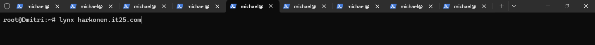
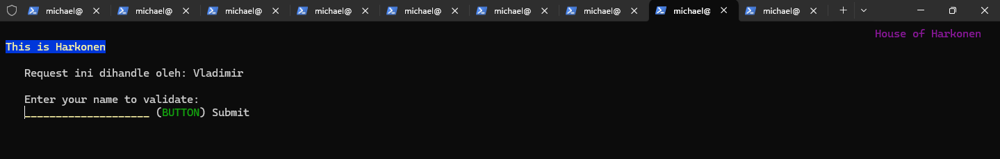
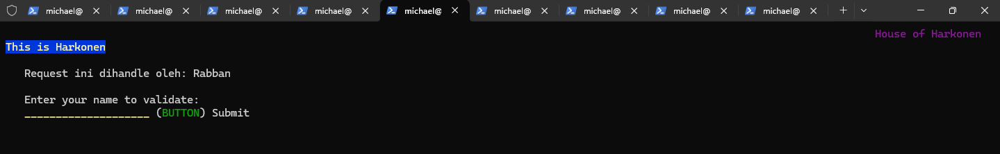
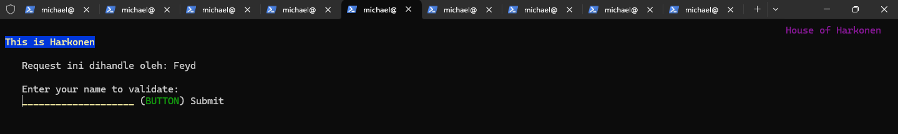

## Soal 7
Aturlah agar Stilgar dari fremen dapat dapat bekerja sama dengan maksimal, lalu lakukan testing dengan 5000 request dan 150 request/second

#### Client

soal_7.sh
```
apt-get update
apt-get install apache2-utils -y
ab -V
ab -n 5000 -c 150 http://harkonen.it25.com/
```

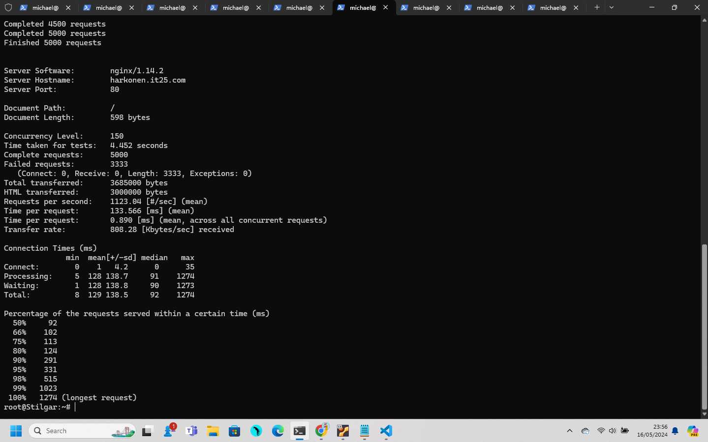

## Soal 8
Karena diminta untuk menuliskan peta tercepat menuju spice, buatlah analisis hasil testing dengan 500 request dan 50 request/second masing-masing algoritma Load Balancer dengan ketentuan sebagai berikut:\
a. Nama Algoritma Load Balancer\
b. Report hasil testing pada Apache Benchmark

Jalankan ```ab -n 500 -c 50 http://harkonen.it25.com/``` pada **client**

1. Round Robin
```
Benchmarking harkonen.it25.com (be patient)
Completed 100 requests
Completed 200 requests
Completed 300 requests
Completed 400 requests
Completed 500 requests
Finished 500 requests


Server Software:        nginx/1.14.2
Server Hostname:        harkonen.it25.com
Server Port:            80

Document Path:          /
Document Length:        602 bytes

Concurrency Level:      50
Time taken for tests:   0.738 seconds
Complete requests:      500
Failed requests:        333
   (Connect: 0, Receive: 0, Length: 333, Exceptions: 0)
Total transferred:      368502 bytes
HTML transferred:       300002 bytes
Requests per second:    677.67 [#/sec] (mean)
Time per request:       73.782 [ms] (mean)
Time per request:       1.476 [ms] (mean, across all concurrent requests)
Transfer rate:          487.74 [Kbytes/sec] received

Connection Times (ms)
              min  mean[+/-sd] median   max
Connect:        0   17   5.1     16      36
Processing:     3   55  10.3     55      84
Waiting:        2   55  10.3     55      84
Total:          3   72  11.0     72      97

Percentage of the requests served within a certain time (ms)
  50%     72
  66%     74
  75%     76
  80%     78
  90%     85
  95%     95
  98%     97
  99%     97
 100%     97 (longest request)
```

2. Least-Connection
```
Benchmarking harkonen.it25.com (be patient)
Completed 100 requests
Completed 200 requests
Completed 300 requests
Completed 400 requests
Completed 500 requests
Finished 500 requests


Server Software:        nginx/1.14.2
Server Hostname:        harkonen.it25.com
Server Port:            80

Document Path:          /
Document Length:        602 bytes

Concurrency Level:      50
Time taken for tests:   0.617 seconds
Complete requests:      500
Failed requests:        334
   (Connect: 0, Receive: 0, Length: 334, Exceptions: 0)
Total transferred:      368498 bytes
HTML transferred:       299998 bytes
Requests per second:    810.80 [#/sec] (mean)
Time per request:       61.668 [ms] (mean)
Time per request:       1.233 [ms] (mean, across all concurrent requests)
Transfer rate:          583.55 [Kbytes/sec] received

Connection Times (ms)
              min  mean[+/-sd] median   max
Connect:        1   13   5.4     13      28
Processing:     3   47   6.4     46      62
Waiting:        2   47   6.5     46      62
Total:          4   60   8.1     62      73

Percentage of the requests served within a certain time (ms)
  50%     62
  66%     64
  75%     66
  80%     67
  90%     68
  95%     69
  98%     70
  99%     71
 100%     73 (longest request)
```

3. IP Hash
```
Benchmarking harkonen.it25.com (be patient)
Completed 100 requests
Completed 200 requests
Completed 300 requests
Completed 400 requests
Completed 500 requests
Finished 500 requests


Server Software:        nginx/1.14.2
Server Hostname:        harkonen.it25.com
Server Port:            80

Document Path:          /
Document Length:        598 bytes

Concurrency Level:      50
Time taken for tests:   0.637 seconds
Complete requests:      500
Failed requests:        0
Total transferred:      367500 bytes
HTML transferred:       299000 bytes
Requests per second:    785.20 [#/sec] (mean)
Time per request:       63.678 [ms] (mean)
Time per request:       1.274 [ms] (mean, across all concurrent requests)
Transfer rate:          563.59 [Kbytes/sec] received

Connection Times (ms)
              min  mean[+/-sd] median   max
Connect:        0   14   5.0     16      25
Processing:     2   48   7.7     49      61
Waiting:        1   48   7.7     48      61
Total:          3   62  10.0     62      78

Percentage of the requests served within a certain time (ms)
  50%     62
  66%     67
  75%     68
  80%     70
  90%     73
  95%     75
  98%     77
  99%     77
 100%     78 (longest request)
```

4. Generic Hash
```
Benchmarking harkonen.it25.com (be patient)
Completed 100 requests
Completed 200 requests
Completed 300 requests
Completed 400 requests
Completed 500 requests
Finished 500 requests


Server Software:        nginx/1.14.2
Server Hostname:        harkonen.it25.com
Server Port:            80

Document Path:          /
Document Length:        600 bytes

Concurrency Level:      50
Time taken for tests:   1.335 seconds
Complete requests:      500
Failed requests:        0
Total transferred:      368500 bytes
HTML transferred:       300000 bytes
Requests per second:    374.43 [#/sec] (mean)
Time per request:       133.538 [ms] (mean)
Time per request:       2.671 [ms] (mean, across all concurrent requests)
Transfer rate:          269.48 [Kbytes/sec] received

Connection Times (ms)
              min  mean[+/-sd] median   max
Connect:        0   13   5.2     13      25
Processing:     2   45  43.4     43    1002
Waiting:        1   45  43.4     43    1002
Total:          2   58  44.1     58    1021

Percentage of the requests served within a certain time (ms)
  50%     58
  66%     59
  75%     61
  80%     62
  90%     66
  95%     67
  98%     68
  99%     68
 100%   1021 (longest request)
```

c. Grafik request per second untuk masing masing algoritma.\
d. Analisis (8)

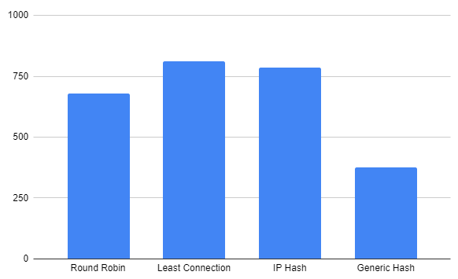

Berdasarkan data di atas, Least Connection merupakan pilihan load balancing yang optimal karena mempertimbangkan jumlah koneksi yang sedang ditangani oleh setiap server secara dinamis, menghindari overload dengan menyesuaikan pembagian beban, mengoptimalkan kinerja sistem dengan memastikan responsivitas yang seimbang, dan meningkatkan skalabilitas dengan fleksibilitas dalam mengatasi fluktuasi jumlah server dan permintaan.

## Soal 9
Dengan menggunakan algoritma Least-Connection, lakukan testing dengan menggunakan 3 worker, 2 worker, dan 1 worker sebanyak 1000 request dengan 10 request/second, kemudian tambahkan grafiknya pada peta.

Jalankan ```ab -n 1000 -c 10 http://harkonen.it25.com/``` pada **client**

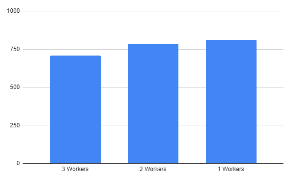

## Soal 10
Selanjutnya coba tambahkan keamanan dengan konfigurasi autentikasi di LB dengan dengan kombinasi username: “secmart” dan password: “kcksyyy”, dengan yyy merupakan kode kelompok. Terakhir simpan file “htpasswd” nya di /etc/nginx/supersecret/

#### Stilgar (Load Balancer)

soal_10.sh
```
apt-get install apache2-utils -y

mkdir /etc/nginx/supersecret
htpasswd -b -c /etc/nginx/supersecret/htpasswd secmart kcksit25

apt-get update
apt-get install bind9 nginx -y

echo '
 upstream myweb  {
        least_conn;
        server 10.76.1.1; #IP Vladimir
        server 10.76.1.2; #IP Rabban
        server 10.76.1.3; #IP Feyd
 }

 server {
        listen 80;
        server_name harkonen.it25.com;

        location / {
        auth_basic "Restricted Access";
        auth_basic_user_file /etc/nginx/supersecret/htpasswd;
        proxy_pass http://myweb;
        }
 }' > /etc/nginx/sites-available/lb-jarkom

ln -s /etc/nginx/sites-available/lb-jarkom /etc/nginx/sites-enabled
rm -rf /etc/nginx/sites-enabled/default

service nginx restart
nginx -t
```


#### Dmitri (Client)

Jalankan  ```curl -u secmart:kcksit25 harkonen.it25.com```

Output
```
<!DOCTYPE html>
<html>
<head>
    <title>House of Harkonen</title>
    <link rel="stylesheet" type="text/css" href="css/styles.css">
</head>
<body>
    <div class="container">
        <h1>This is Harkonen</h1>
        <p>Request ini dihandle oleh: Vladimir<br> </p>
        <p>Enter your name to validate:</p>
        <form method="POST" action="index.php">
            <input type="text" name="name" id="nameInput">
            <button type="submit" id="submitButton">Submit</button>
        </form>
        <p id="greeting"></p>
    </div>

    <script src="js/script.js"></script>
</body>
</html>
```

## Soal 11
Lalu buat untuk setiap request yang mengandung /dune akan di proxy passing menuju halaman https://www.dunemovie.com.au/

#### Stilgar (Load Balancer)

```
echo nameserver 10.76.3.1 > /etc/resolv.conf
apt-get update
apt-get install bind9 nginx -y

echo '
 upstream myweb  {
        least_conn;
        server 10.76.1.1; #IP Vladimir
        server 10.76.1.2; #IP Rabban
        server 10.76.1.3; #IP Feyd
 }

 server {
        listen 80;
        server_name harkonen.it25.com;

        location / {
        proxy_pass http://myweb;
        }

        location /dune/ {
        proxy_pass https://www.dunemovie.com.au/;
        }
 }' > /etc/nginx/sites-available/lb-jarkom

ln -s /etc/nginx/sites-available/lb-jarkom /etc/nginx/sites-enabled
rm -rf /etc/nginx/sites-enabled/default

service nginx restart
nginx -t
```

#### Client

Jalankan ```lynx harkonen.it25.com/dune```

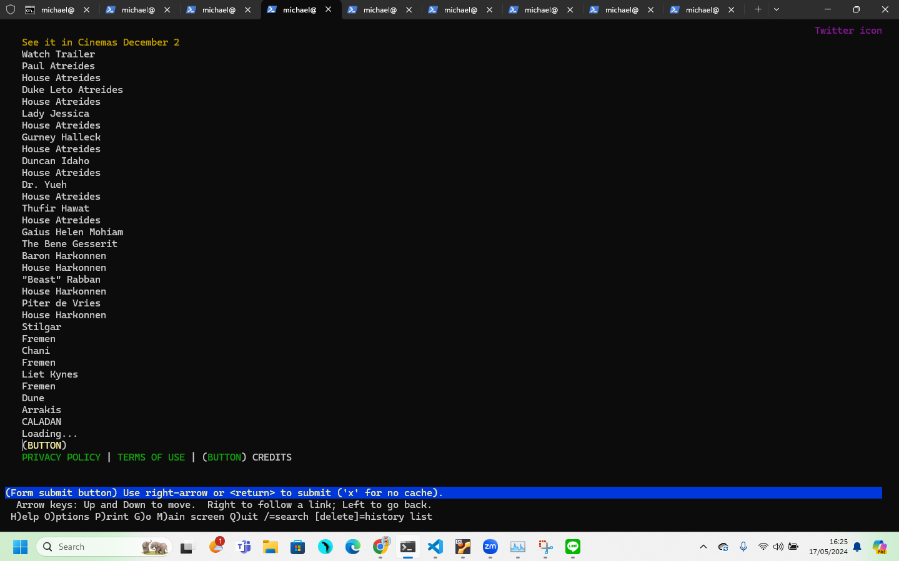

## Soal 12
Selanjutnya LB ini hanya boleh diakses oleh client dengan IP [Prefix IP].1.37, [Prefix IP].1.67, [Prefix IP].2.203, dan [Prefix IP].2.207.

#### Stilgar (Load Balanncer)

soal_12.sh
```
echo nameserver 10.76.3.1 > /etc/resolv.conf
apt-get update
apt-get install bind9 nginx -y

echo '
 upstream myweb  {
        least_conn;
        server 10.76.1.1; #IP Vladimir
        server 10.76.1.2; #IP Rabban
        server 10.76.1.3; #IP Feyd
 }

 server {
        listen 80;
        server_name harkonen.it25.com;

        location / {
            allow 10.76.1.37;
            allow 10.76.1.76;
            allow 10.76.2.203;
            allow 10.76.2.207;
            deny all;
            proxy_pass http://myweb;
        }
 }' > /etc/nginx/sites-available/lb-jarkom

ln -s /etc/nginx/sites-available/lb-jarkom /etc/nginx/sites-enabled
rm -rf /etc/nginx/sites-enabled/default

service nginx restart
nginx -t
```

#### Mohiam (DHCP Server)

Tambahkan kode berikut ke dalam ```/etc/dhcp/dhcpd.conf```

```
host Dmitri {
   hardware ethernet fe:c0:13:f5:1c:02;
   fixed-address 10.76.1.37;
}
```
Lalu ```service isc-dhcp-server restart```

Tambahkan ```hwaddress ether fe:c0:13:f5:1c:02``` ke dalam _network configuration_ **Dmitri (Client)**

```Stop``` dan ```Start``` pada **Dmitri**

#### Paul (Client) - Tidak ada fixed address

Jalankan perintah ```lynx harkonen.it25.com```

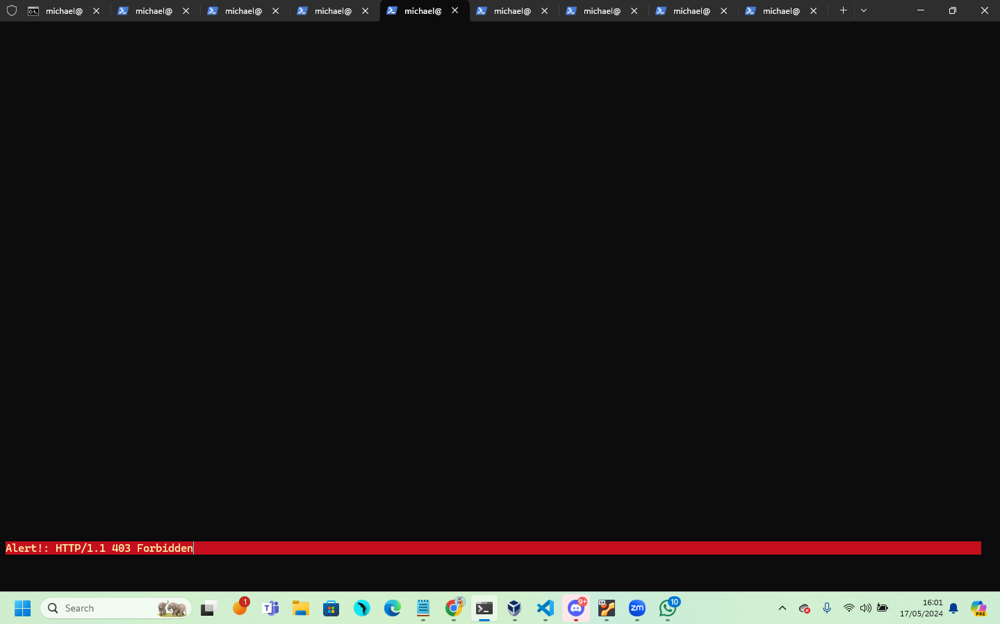

#### Dmitri (Client) - Ada fixed address

Jalankan perintah ```lynx harkonen.it25.com```

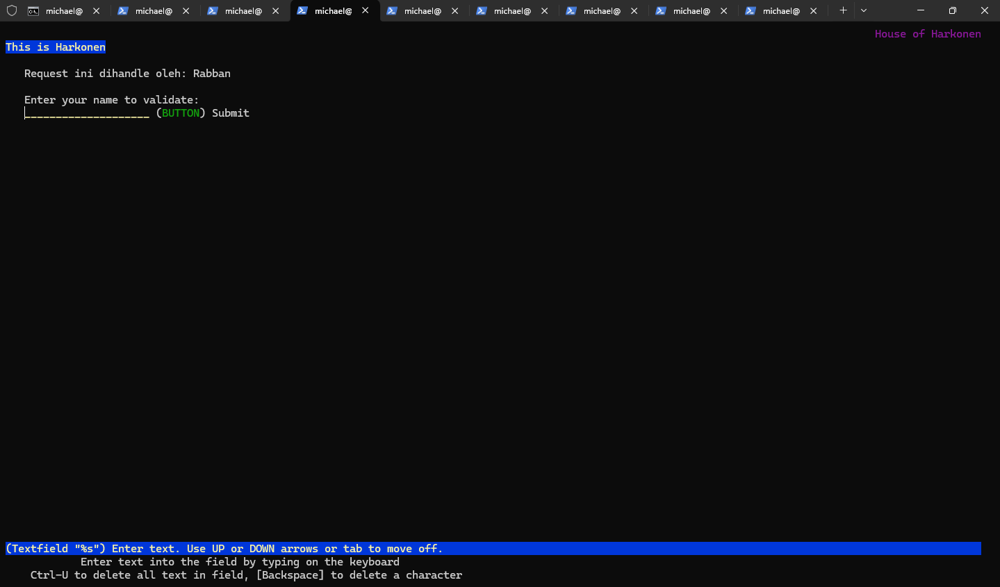

## Soal 13
Tidak mau kalah dalam perburuan spice, House atreides juga mengatur para pekerja di atreides.yyy.com. Semua data yang diperlukan, diatur pada Chani dan harus dapat diakses oleh Leto, Duncan, dan Jessica

Sambungkan Chani dengan DNS Server. Tambahkan IP Irulan di resolv.conf Chani

```bash
echo 'nameserver 10.76.3.1' > etc/resolv.conf
```

Install package mariadb-server, jangan lupa untuk lakukan update terlebih dahulu

```bash
apt-get update
apt-get install mariadb-server -y
service mysql start
```
Jalankan service mysql dengan script berikut
```bash
service mysql start
```

Sebelum memasukkan command sql kita perlu terlebih dahulu login ke dalam mysql, eksekusi command berikut ini
```bash
mysql -u root -p
```
Untuk password defaultnya adalah : **root**     

Disini kita sudah berhasil untuk login sebagai user root pada service mysql


Konfigurasikan mySQL untuk aplikasi Laravel yang akan digunakan dengan mengeksekusi query berikut
```sql
CREATE USER 'kelompokit25'@'%' IDENTIFIED BY 'passwordit25';
CREATE USER 'kelompokit25'@'localhost' IDENTIFIED BY 'passwordit25';
CREATE DATABASE DBit25;
GRANT ALL PRIVILEGES ON *.* TO 'kelompokit25'@'%';
GRANT ALL PRIVILEGES ON *.* TO 'kelompokit25'@'localhost';
FLUSH PRIVILEGES;
```

Karena database perlu dapat diakses oleh Laravel Worker, ubah script pada ```/etc/mysql/my.cnf```
```bash
[mysqld]
skip-networking=0
skip-bind-address
```

Dan juga pada file ```/etc/mysql/mariadb.conf.d/50-server.cnf```
```bash
bind-address            = 0.0.0.0
```

lalu restart
```bash
service restart mysql
```

Setelah semua konfigurasi selesai, kita dapat melakukan testing pada salah satu worker, disini kami menggunakan Worker Duncan yang memiliki IP Address **10.76.2.2** dengan menginstallasi package mariadb-client dan menggunakan command berikut
```bash
apt-get install mariadb-client -y
```

```bash
mariadb --host=10.76.2.2 --port=3306 --user=kelompokit25 --password=passwordit25 DBit25
```


## Soal 14
Leto, Duncan, dan Jessica memiliki atreides Channel sesuai dengan quest guide berikut. Jangan lupa melakukan instalasi PHP8.0 dan Composer

Di nomor 14 ini kita akan melakukan installasi aplikasi Laravel pada ketiga worker Laravel. Aplikasikan langkah-langkah dibawah ini di ketiga worker.

Tambahkan IP Irulan di resolv.conf worker
```bash
echo 'nameserver 10.76.3.1' > etc/resolv.conf
```

lalu install package yang diperlukan
```bash
apt-get update

# Lynx, Engine X
apt-get install lynx -y
apt-get install nginx -y

# PHP 8.0
apt-get install -y lsb-release ca-certificates apt-transport-https software-properties-common gnupg2
curl -sSLo /usr/share/keyrings/deb.sury.org-php.gpg https://packages.sury.org/php/apt.gpg
sh -c 'echo "deb [signed-by=/usr/share/keyrings/deb.sury.org-php.gpg] https://packages.sury.org/php/ $(lsb_release -sc) main" > /etc/apt/sources.list.d/php.list'

apt-get update
apt-get install php8.0-mbstring php8.0-xml php8.0-cli php8.0-common php8.0-intl php8.0-opcache php8.0-readline php8.0-mysql php8.0-fpm php8.0-curl unzip wget -y
php --version

service nginx start
service php8.0-fpm start

# Composer
wget https://getcomposer.org/download/2.0.13/composer.phar
chmod +x composer.phar
mv composer.phar /usr/bin/composer
composer -V

# Git
apt-get install git -y
```
selanjutnya kita akan melakukan *git clone* pada aplikasi Laravel yang akan kita gunakan. 
```bash
git clone https://github.com/martuafernando/laravel-praktikum-jarkom.git
```
Pindahkan hasil clone tersebut kedalam folder ```/var/www/laravel-praktikum-jarkom```
```bash
mv laravel-praktikum-jarkom /var/www/laravel-praktikum-jarkom
```

Sebelum mulai melakukan konfigurasi, kita terlebih dahulu perlu menginstall modul yang ada pada aplikasi Laravel kita menggunakan composer
```bash
cd /var/www/laravel-praktikum-jarkom
composer update
composer install
```

Setelah itu, rename file ```.env.example``` menjadi ```.env```, dan lakukan konfigurasi sebagai berikut
```bash
DB_CONNECTION=mysql
DB_HOST=10.76.4.1
DB_PORT=3306
DB_DATABASE=dbkelompokit25
DB_USERNAME=kelompokit25
DB_PASSWORD=passwordit25
```

Konfigurasi tersebut akan menghubungkan aplikasi dengan database yang sudah dibuat sebelumnya. Setelah itu, eksekusi command Laravel berikut
```bash
php artisan migrate:fresh
php artisan db:seed --class=AiringsTableSeeder
php artisan key:generate
php artisan jwt:secret
php artisan storage:link
```

Kita juga perlu melakukan konfigurasi nginx, lakukan konfigurasi seperti dibawah ini pada file ```/etc/nginx/sites-available/laravel-worker```

```bash
touch /etc/nginx/sites-available/laravel

echo 'server {

        listen 8001; #ubah sesuai worker
        root /var/www/laravel-praktikum-jarkom/public;

        index index.php index.html index.htm;
        server_name _;

        location / {
                try_files $uri $uri/ /index.php?$query_string;
        }

        # pass PHP scripts to FastCGI server
        location ~ \.php$ {
        include snippets/fastcgi-php.conf;
        fastcgi_pass unix:/var/run/php/php8.0-fpm.sock;
        }

location ~ /\.ht {
            deny all;
    }

        error_log /var/log/nginx/implementasi_error.log;
        access_log /var/log/nginx/implementasi_access.log;
}' > /etc/nginx/sites-available/laravel

service php8.0-fpm restart
service nginx restart
```

Kemudian lakukan symlink dan kelola akses izin
```bash
ln -s /etc/nginx/sites-available/laravel /etc/nginx/sites-enabled/
chown -R www-data.www-data /var/www/laravel-praktikum-jarkom/
```

Jangan lupa untuk melakukan restart pada nginx dan PHP 8.0
```bash
service nginx restart
service php8.0-fpm start
```

Untuk melakukan testing kita dapat menggunakan **lynx localhost:[port]** sesuai dengan Worker yang kita gunakan. Disini kami akan melakukan testing pada worker Jessica dengan port 8001
```bash
lynx localhost:8001
```
Jika sudah berhasil, akan tampil tampilan berikut


